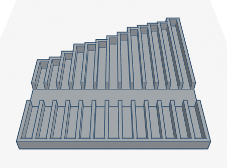
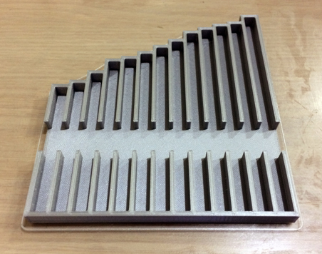
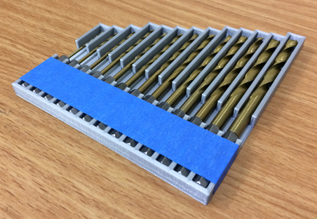

# Drill Bit Tray Model

# Introduction

This repository contains a 3D model of a tray that can be used to carry drill bits.

The tray was custom-designed using [Tinkercad](https://www.tinkercad.com), a free, online 3D modeling app. The tray was designed specifically to carry [this set of 13 *Warrior* Titanium Nitride High Speed Steel Drill Bits](https://www.harborfreight.com/13-piece-titanium-nitride-coated-drill-bits-1800.html) distributed by Harbor Freight Tools in Camarillo, CA. Each drill bit has a 1/4" [hex shank](https://en.wikipedia.org/wiki/Drill_bit_shank#Hex_shank) at one of its ends.

# Photos

